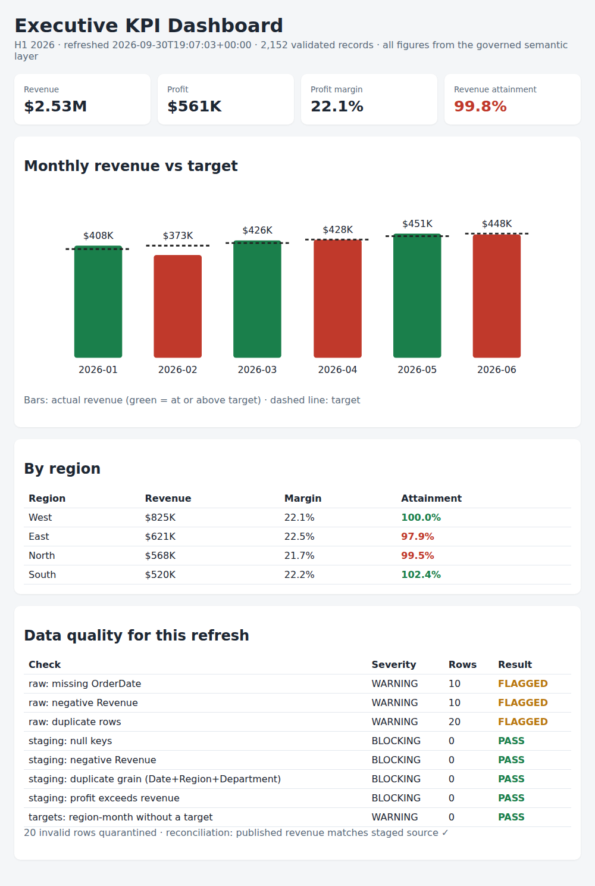

# Enterprise KPI & Self-Service Analytics Hub


A governed KPI pipeline that turns raw sales operations data into **one trusted set of KPI numbers**: SQL staging, a **data-quality gate** that stops bad data from being published, a semantic KPI layer, **row-level security**, revenue **reconciliation**, and an **executive dashboard**, refreshed automatically every weekday by GitHub Actions.



## Business problem

Different teams often report the same KPI with different definitions, so leaders see conflicting numbers. This hub gives every KPI one approved definition and owner, checks the data before publishing, and lets each user see only the regions they are authorized for.

## Results from a refresh

Six months of generated sales data (4 regions × 3 departments, 2 source systems) with deliberately injected errors:

| Step | Result |
|---|---|
| Raw rows loaded | 2,192 |
| Invalid rows quarantined | 20 (10 missing dates, 10 negative revenue) |
| Duplicate rows removed | 20 |
| Validated rows | 2,152 |
| Blocking quality checks | 4 of 4 passed |
| Reconciliation | Published revenue = staged revenue ($2,534,460.98) |
| Refresh time | under 1 second |

- **8 automated tests** covering the quality gate, reconciliation, row-level security and KPI formulas
- Refresh runs on every push, **every weekday at 7:00 ET**, and on demand; each run publishes the dashboard as a downloadable artifact

## How it works

```
sales_ops.csv ─┐
kpi_targets.csv ┼─► 01_staging.sql ─► 02_quality_checks.sql ─► 03_semantic_metrics.sql ─► reconcile ─► dashboard + KPI extract
user_region.csv ┘   (types, dedupe,     (BLOCKING checks stop      (one definition per KPI)      (to the cent)   + refresh log
                     quarantine)         the refresh)                          │
                                                                               └─► 04_row_level_security.sql (per-user view)
```

| Layer | File | What it does |
|---|---|---|
| Staging | `sql/01_staging.sql` | Casts types, removes duplicates, moves invalid rows to `stg_rejected` with a reason |
| Quality gate | `sql/02_quality_checks.sql` | 8 checks; any failed BLOCKING check stops the refresh before publishing |
| Semantic layer | `sql/03_semantic_metrics.sql` | Revenue, Profit, Margin, Orders, Revenue per Order, Target, Attainment |
| Row-level security | `sql/04_row_level_security.sql` | Regional managers see their region; the CFO sees all; unknown users see nothing |
| Pipeline | `kpi_hub/pipeline.py` | Runs the SQL in DuckDB, reconciles totals, writes outputs and the refresh log |
| Dashboard | `kpi_hub/dashboard.py` | Self-contained HTML: KPI cards, revenue vs target, regions, data-quality panel |
| Automated refresh | `.github/workflows/kpi-refresh.yml` | Tests + refresh on push, on a weekday schedule, and on demand |
| Power BI | `powerbi/DAX_Measures.md` | The same KPI definitions as DAX measures, plus the RLS role design |

## Governance

- [KPI catalog](governance/kpi_catalog.md): one definition, owner and grain per KPI
- [Row-level security](governance/row_level_security.md): mapping-table design, implemented in SQL
- [Data ownership](governance/data_ownership.md) and escalation path
- [Refresh and deployment](docs/refresh_deployment.md) and [self-service guidelines](docs/self_service_guidelines.md)

## Run it

```bash
pip install -r requirements.txt
python -m kpi_hub.pipeline          # refresh; open output/kpi_dashboard.html in a browser
pytest -v                           # run the tests
python scripts/generate_data.py     # regenerate the sample data (seeded, reproducible)
```

## Tech stack

SQL (DuckDB), Python, pytest, GitHub Actions, HTML/CSS/SVG dashboard, Power BI DAX (measure definitions)

## Limitations

The data is generated, not from a real company. The dashboard is a static HTML report rather than a hosted Power BI workspace; the DAX measures and RLS design in `powerbi/` show how the same model maps to Power BI.
